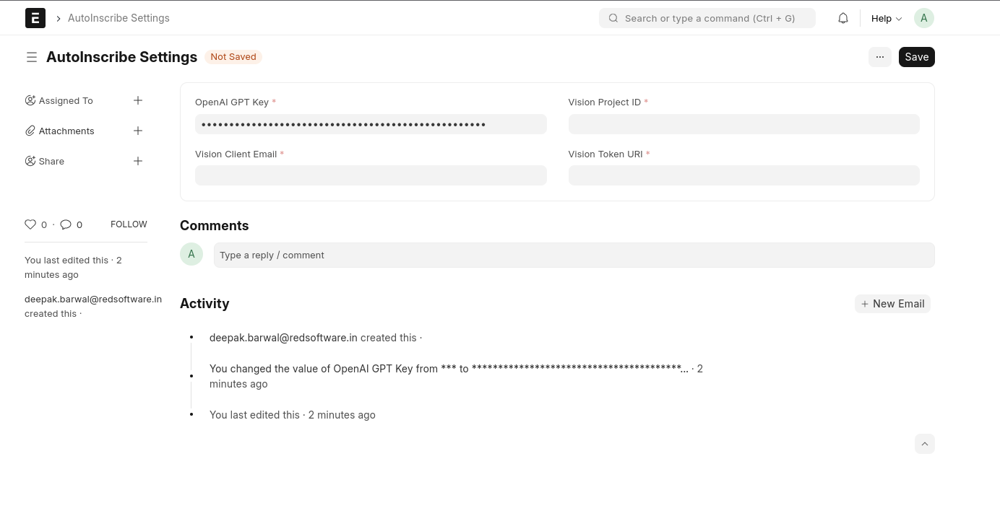
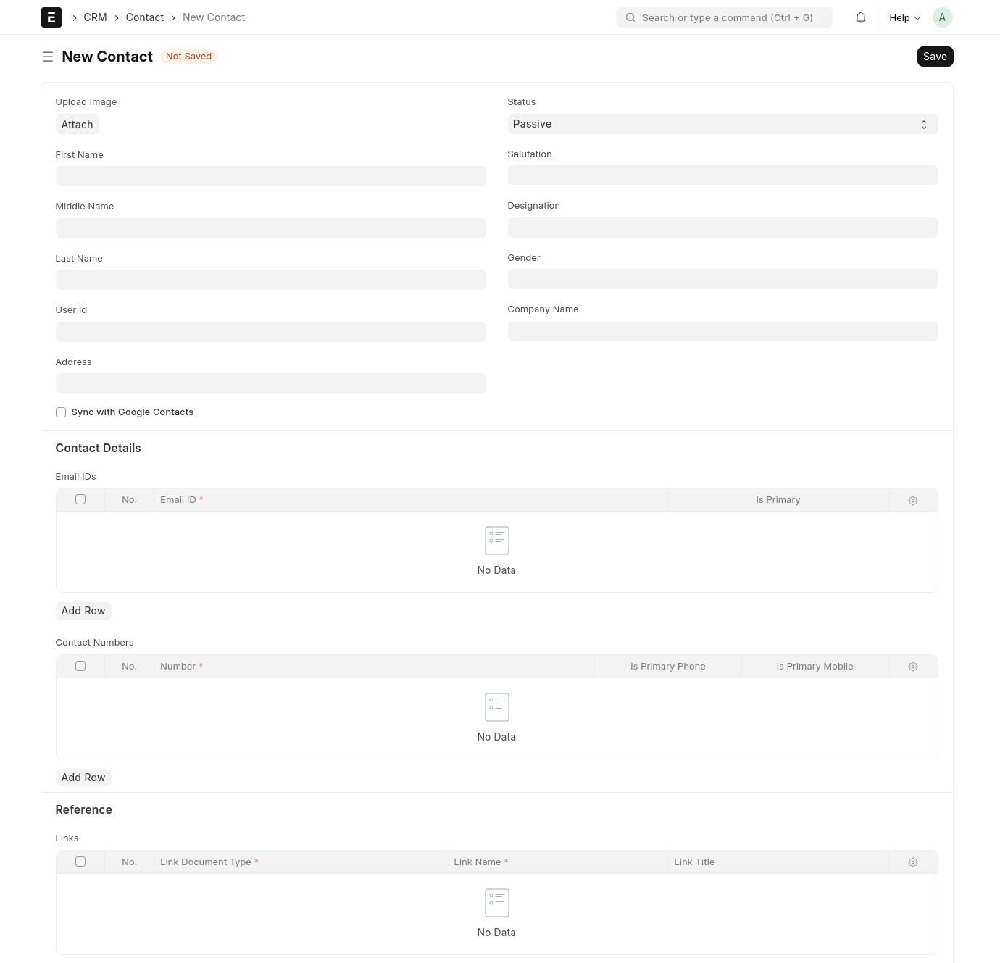
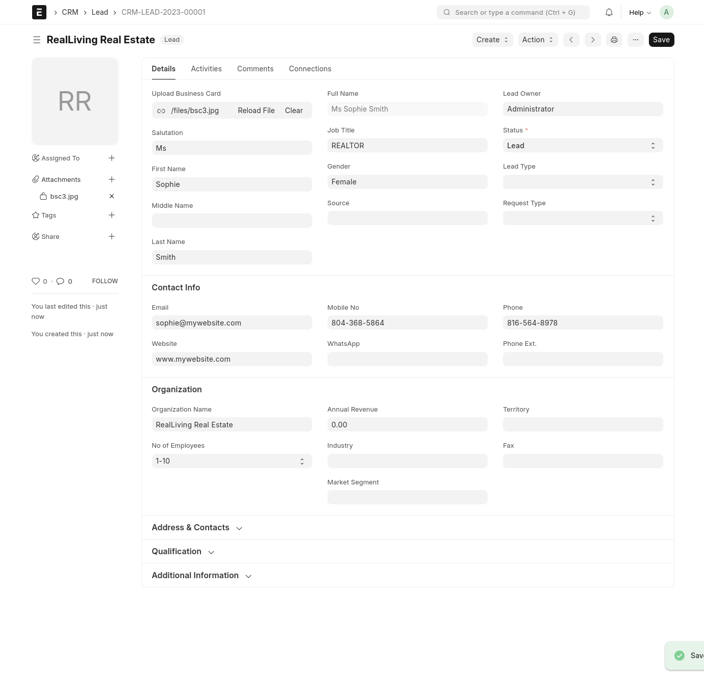

<p align="center">
  
  <h1 align="center">AutoInscribe</h1>
  <p align="center">Seamless automatic data capture and integration solution</p>
</p>
<p align="center">
  <a href="https://github.com/The-Commit-Company/autoinscribe/blob/main/LICENSE">
    
  </a>
</p>

<br>

AutoInscribe is a tool for simplifying OCR that is built using [Frappe Framework](https://frappeframework.com) and requires a new or existing Frappe site (with ERPNext installed). It empowers users to streamline their workflow by seamlessly uploading business card photos for automatic extraction and storage of contact and lead information

<hr>

## Pre-Requisites to be installed

1. [Frappe Framework](https://frappeframework.com) - v15 or above
2. [ERPNext](https://erpnext.com/) - v14 or above

<hr>

## Features

1. Easily upload business card images directly into the system for automated data extraction
2. Leveraging the power of Google Vision API, AutoInscribe swiftly extracts text from uploaded images, ensuring accurate retrieval of contact details like name, phone numbers, email addresses, and more
3. Utilizing OpenAI's GPT technology, the app provides concise and comprehensive text summarization. This feature condenses extracted information into precise summaries, enhancing readability and usability
4. Once text is extracted and summarized, AutoInscribe autonomously populates and saves the relevant fields in the Contact or Lead doctype within Frappe. This automated process saves time and reduces manual data entry, ensuring data accuracy and consistency
5. User can configure the app settings using "AutoInscribe Settings" doctype

<hr>

<br>

<p align="center">
    <figure>
        
         <figcaption align="center">
            <b>Autoinscribe Settings</b>
        </figcaption>
    </figure>
</p>

<details>
  <summary>Show more screenshots</summary>
  

  <figure>
      
      <figcaption align="center"><b>Upload Image Field</b></figcaption>
  </figure>
  
  <figure>
      
      <figcaption align="center"><b>Autofilled Lead</b></figcaption>
  </figure>
</details>

<hr>

## Installation for self-hosted users:

It can be installed via [frappe-bench](https://frappeframework.com/docs/v14/user/en/bench) on your local machine or on your production site.

Once you have [setup your bench](https://frappeframework.com/docs/v14/user/en/installation) and your [site](https://frappeframework.com/docs/v14/user/en/tutorial/install-and-setup-bench), you can install the app via the following commands:

```bash
# development install
$ bench get-app https://github.com/redsoftware-hq/autoInscribe --branch develop

# install on site
$ bench --site yoursite.name install-app autoinscribe
```

Post this, you can use autoinscribe on your Frappe site by searching for AutoInscribe settings then entering your credentials and adding "vision_private_key": <your_private_key> in your site_config.json. 

### Local development setup

To set up your local development environment, make sure that you have enabled [developer mode](https://frappeframework.com/how-to-enable-developer-mode-in-frappe) in your Frappe site config.

<hr>

## Usage

For now, we support only two doctypes: Contact & Lead.
<br>
After installing the app and providing all the secrets/keys, simply go to the "Add" screen of the supported doctype and you'll see an "Upload" field where you can upload the business card image of your choice, make sure to click "Set all public" as we only support public files for now. Then click upload and wait for the fields to populate.

### Contributing

- Send PRs to `develop` branch only.

<hr>

## Reporting Bugs
If you find any bugs, feel free to report them here on [GitHub Issues](https://github.com/redsoftware-hq/autoInscribe/issues). Make sure you share enough information (app screenshots, browser console screenshots, stack traces, etc) for project maintainers to replicate your bug.

<hr>

## License

AGPLv3